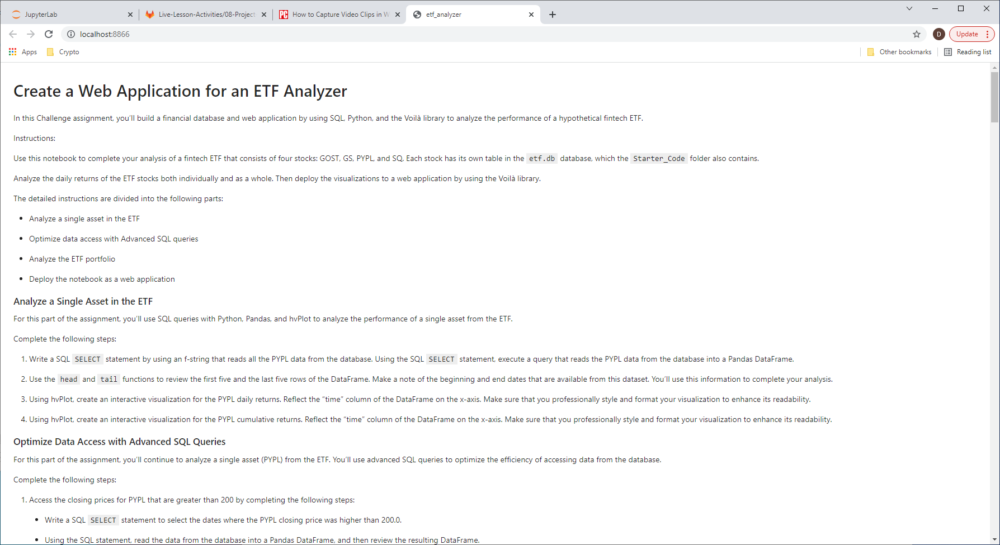
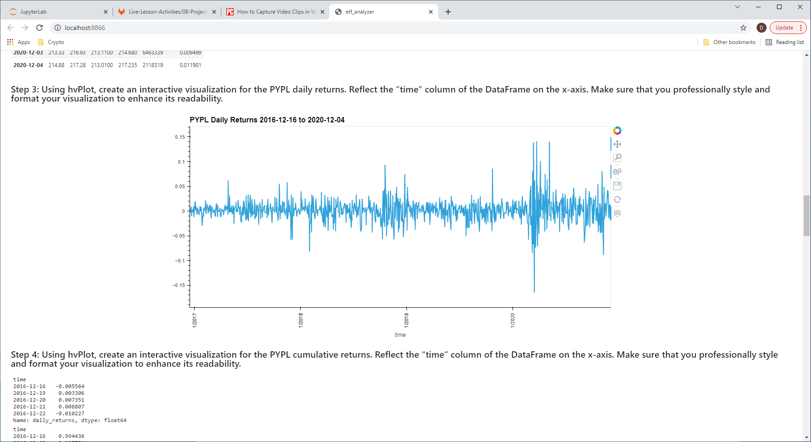
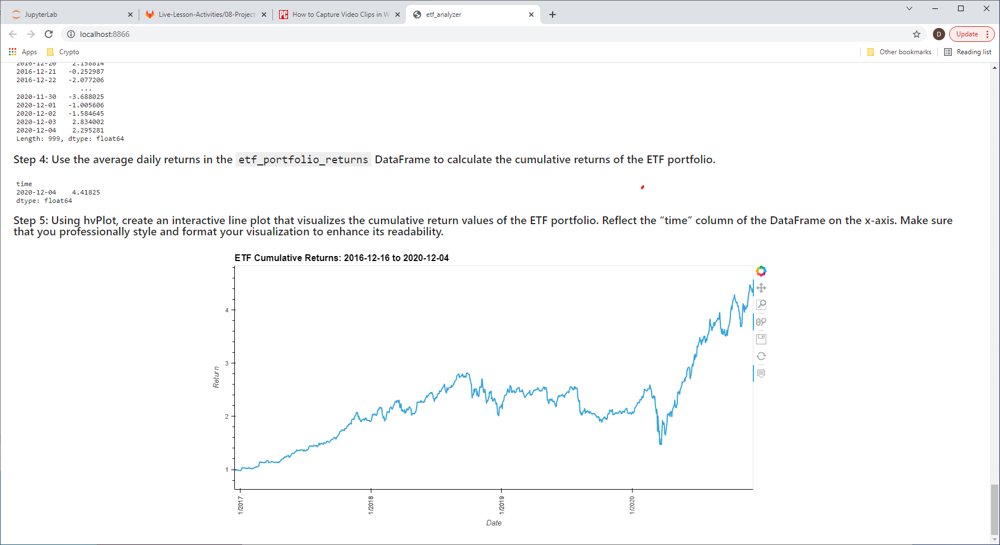

# ETF-Analyzer
### Build a financial database and web application by using SQL, Python, and the Voilà library to analyze the performance of a hypothetical fintech ETF.
---
## Technologies

Python modules used:

* pandas
* hvplot
* numpy
* sqlalchemy
---
## In a Jupyter Notebook:
Analyze a Single Asset in the ETF
* SQL query to read ticker data into DataFrame
* hvPlot daily and cumulative returns

Optimize Data Access -- Advance SQL Queries
* SQL SELECT, WHERE
* ORDER
* LIMIT
* conditionals

Analyze the ETF Portfolio
* SQL inner join of tables
* SQL query to read ETF data into DataFrame
* Compute daily returns, annualized returns, cummulative returns
* hvPlot cumulative returns

Use Voilà to deploy the notebook as a Web Application:
 
 
 
---
## Contributors

[David Jonathan](https://www.linkedin.com/in/david-jonathan-1b9470/)

---

## License

Licensed under the [MIT License](https://github.com/tmbo/questionary/blob/master/LICENSE). Copyright 2021 David Jonathan